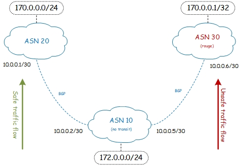

# RPKI (My)Lab Environment

## Context 

Recently I decided to setup a dedicated test Environment to improve my knowledge around Resource Public Key Infrastructure (aka RPKI).
Now that the *testbed* is finally up & running I would like to share my journey with the Community, eventually brainstorming together on how it could be tuned-up.


## Network Setup

Using [eve-ng](https://www.eve-ng.net/) I linked together few routers with the main aim of simulating a BGP IP Hijacking & to try to overcome this security issue implementing RPKI.
For sake of simplicity I deployed only three routers, each one of them belonging to a different BGP Autonomous System. 

The router belonging to **ASN 30** was compromised and started announcing an IP address which overlaps with an IP prefix range *legitimately* advertised by **ASN 20**. From now on, 
whoever is behind **ASN 10** and will try to reach out to **170.0.0.1/32** will be forwarded to the compromised router behind AS 20.

<p align="center">
    
</p>

The BGP protocol will simply prefer the more specific prefix (170.0.0.1/32) over the less specific prefix (170.0.0.1/24). The traffic will flow towards the compromised ASN 30 via next-hop 10.0.0.6.

```
RP/0/0/CPU0:router-asn10#sh bgp sessions
Mon Jul 26 14:28:00.527 CET

Neighbor        VRF                   Spk    AS   InQ  OutQ  NBRState     NSRState
10.0.0.2        default                 0    20     0     0  Established  None
10.0.0.6        default                 0    30     0     0  Established  None

RP/0/0/CPU0:router-asn10#show bgp ipv4 unicast neighbors 10.0.0.2 routes | b ^Status
Mon Jul 26 14:28:13.456 CET
Status codes: s suppressed, d damped, h history, * valid, > best
              i - internal, r RIB-failure, S stale, N Nexthop-discard
Origin codes: i - IGP, e - EGP, ? - incomplete
   Network            Next Hop            Metric LocPrf Weight Path
*> 170.0.0.0/24       10.0.0.2                 0             0 20 i

Processed 1 prefixes, 1 paths

RP/0/0/CPU0:router-asn10#show bgp ipv4 unicast neighbors 10.0.0.6 routes | b ^Status
Mon Jul 26 14:28:23.945 CET
Status codes: s suppressed, d damped, h history, * valid, > best
              i - internal, r RIB-failure, S stale, N Nexthop-discard
Origin codes: i - IGP, e - EGP, ? - incomplete
   Network            Next Hop            Metric LocPrf Weight Path
*> 170.0.0.1/32       10.0.0.6                 0             0 30 i

Processed 1 prefixes, 1 paths

RP/0/0/CPU0:router-asn10#traceroute 170.0.0.1
Mon Jul 26 14:28:48.354 CET

Type escape sequence to abort.
Tracing the route to 170.0.0.1

 1  10.0.0.6 9 msec  *  0 msec 
RP/0/0/CPU0:router-asn10#

```

## RPKI IT Infrastructure Setup

[nlnetlabs](https://www.nlnetlabs.nl/) is one of the main reference when it comes to RPKI: they wrote extremely clear [Documentation](https://rpki.readthedocs.io/) about this subject and last but not least 
they developed some of they key software components I utilized within (My)Lab Infrastructure.    